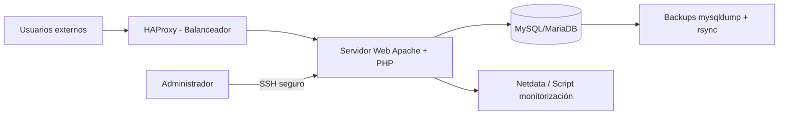

# 02. Diseño de la infraestructura

## 1. Resumen del diseño

La infraestructura propuesta se basa en un servidor LAMP documentado sobre Ubuntu Server 22.04. El diseño contempla servicios web, base de datos, acceso remoto seguro, firewall, monitorización y copias de seguridad.

En la sesión 4 se añade un balanceador HAProxy delante del servidor Apache para simular un cambio de alcance solicitado por el cliente.

## 2. Arquitectura lógica



## 3. Componentes principales

| Componente | Función | Puerto |
|---|---|---|
| HAProxy | Balanceo de carga HTTP/HTTPS | 80, 443 |
| Apache | Servidor web | 80, 443 |
| PHP | Procesamiento de aplicación web | No aplica |
| MySQL/MariaDB | Base de datos | 3306 |
| SSH | Administración remota | 22 |
| UFW | Firewall local | No aplica |
| Netdata | Monitorización | 19999 |
| rsync | Sincronización de backups | 22 |

## 4. Tabla de versiones

Esta tabla se usa para provocar el conflicto de la sesión 2.

| Software | Versión documentada | Uso |
|---|---:|---|
| Ubuntu Server | 22.04 LTS | Sistema base |
| Apache | 2.4.60 | Servidor web, versión resuelta tras conflicto |
| PHP | 8.1 | Lenguaje de servidor |
| MySQL | 8.0 | Base de datos |
| Certbot | 2.9 | SSL/TLS automático añadido tras conflicto |
| HAProxy | 2.8 | Balanceador añadido en sesión 4 |
| Netdata | Última estable | Monitorización |
| UFW | Incluido en Ubuntu | Firewall |

## 5. Redes y seguridad

| Elemento | Decisión |
|---|---|
| Acceso SSH | Permitido solo a administradores |
| Tráfico web | Permitido en 80/tcp y 443/tcp |
| Base de datos | No expuesta públicamente |
| Backups | Copias locales y sincronización externa |
| Monitorización | Acceso restringido o protegido por firewall |

## 6. Diseño del balanceador HAProxy

El balanceador se coloca delante de Apache para recibir peticiones HTTP/HTTPS y reenviarlas al servidor web.

Ejemplo documental de configuración:

```haproxy
frontend http_front
    bind *:80
    default_backend apache_back

backend apache_back
    server web01 192.168.1.10:80 check
```

## 7. Justificación

El diseño es adecuado para una PYME porque:

- Usa tecnologías conocidas y documentadas.
- Permite administración remota segura.
- Facilita recuperación mediante backups.
- Incluye monitorización básica.
- Puede evolucionar con balanceo de carga.
