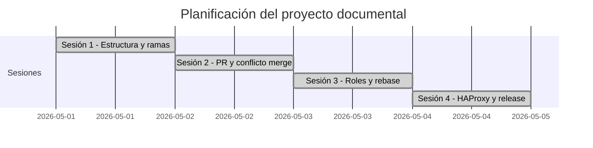

# 03. Planificación del proyecto

## 1. Objetivo

Planificar la elaboración de la documentación técnica del despliegue LAMP y organizar el trabajo colaborativo mediante Git y GitHub.

## 2. Plan por sesiones

| Sesión | Objetivo | Resultado esperado |
|---|---|---|
| Sesión 1 | Crear repositorio, estructura y primeras ramas | README, estructura y dos PR abiertos |
| Sesión 2 | Revisar, mergear y resolver conflicto | PR mergeados y conflicto en `02-diseno.md` resuelto |
| Sesión 3 | Intercambiar roles y usar rebase | Documentos restantes y conflicto en `ssh-firewall.md` resuelto |
| Sesión 4 | Cambio de alcance y release | HAProxy documentado, issue, release `v1.0` y `REVISION.md` |

## 3. Reparto inicial

| Persona | Rama | Archivos |
|---|---|---|
| Alumno A | `feature/plataforma-base` | `01-analisis.md`, `02-diseno.md` |
| Alumno B | `feature/operaciones` | `monitorizacion.md`, `backups.md` |

## 4. Reparto tras intercambio de roles

| Persona | Rama | Archivos |
|---|---|---|
| Alumno A | `feature/guia-operacion` | `05-operacion.md`, `06-recuperacion.md`, `CHANGELOG.md` |
| Alumno B | `feature/servidor-web-y-bd` | `servidor-web.md`, `base-de-datos.md`, `ssh-firewall.md` |

## 5. Cambio de alcance de sesión 4

El cliente solicita añadir HAProxy.

| Persona | Rama | Archivos |
|---|---|---|
| Alumno A | `feature/balanceador-diseno` | `02-diseno.md`, `03-planificacion.md` |
| Alumno B | `feature/balanceador-config` | `servidor-web.md`, `05-operacion.md` |

## 6. Diagrama de planificación

## 7. Criterios de control

- Cada rama debe tener commits propios.
- Cada PR debe tener revisión del compañero.
- Los conflictos deben quedar visibles en el historial.
- `main` debe mantenerse protegida.
- El release final debe llamarse `v1.0`.
